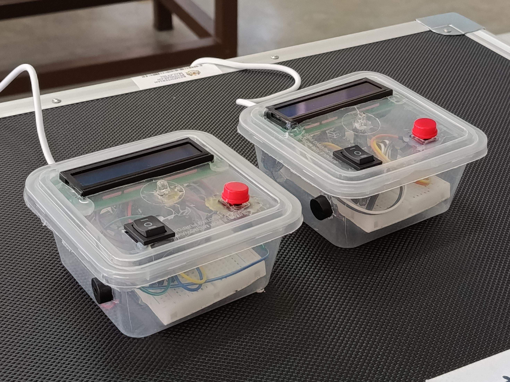
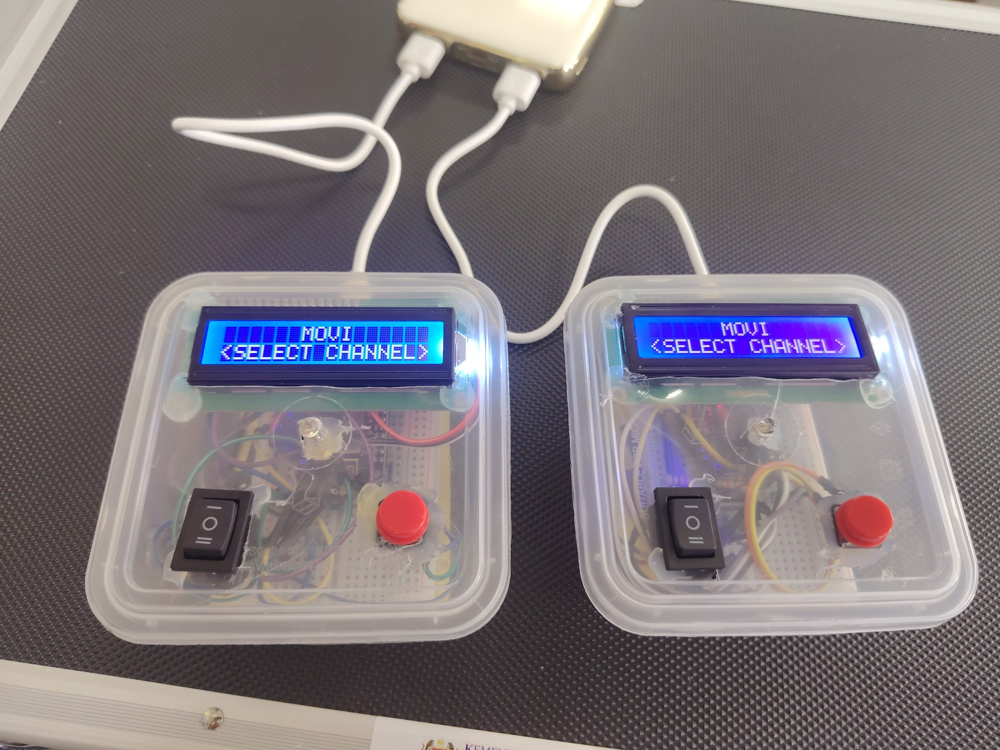
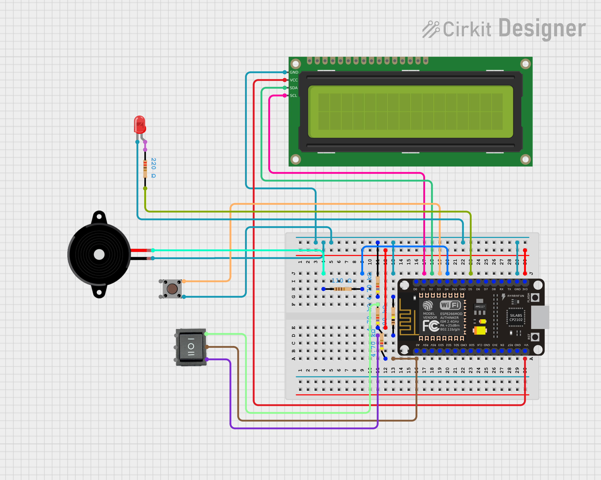

# Movi

[ESP8266](https://docs.platformio.org/en/latest/boards/espressif8266/nodemcuv2.html) based [Morse code](https://en.wikipedia.org/wiki/Morse_code)/serial data transceiver and education tool.

## 🚀 Project Description

Final Semester Project (FSP) from the students of Tutorial Class E2T2 2025/2026, [Kolej Matrikulasi Kejuruteraan Kedah (KMKK)](http://www.kmkk.matrik.edu.my/) under the guidance of Mr. Ahmad Hazeri bin Md Nor, Electrical & Electronics Engineering (EE015 & EE025) Lecturer.

Movi is designed to inspire future Electrical and Electronics (E&E) engineers by transforming the abstract concept of serial data communication into a hands-on, tactile experience.
By serving as a low-cost, portable alternative to expensive conventional lab equipment, this project actively contributes to [SDG 10: Reduced Inequalities](https://www.un.org/sustainabledevelopment/inequality/).

### 👨‍💻 Group Members

- Mr. Ahmad Hazeri bin Md Nor (Lecturer)
- Jonah Yeh Xian Rong (CEO)
- Liew Yu Hong (COO)
- Go Yu An (CTO)
- Muhammad Luqman Haqeem bin Sulaiman (CFO)

## 🛠️ Hardware Requirements

To replicate a single Movi unit, the following components are required:

- **Microcontroller:** NodeMCU V2 ESP8266
- **Outputs (Visual & Audio):**
  - 16x2 Liquid Crystal Display (with I2C module)
  - 5mm LED
  - Passive Piezoelectric Buzzer
- **Inputs:**
  - Tactile Push Button
  - 3-way Switch
- **Miscellaneous:**
  - Breadboard & connecting wires
  - Resistors
    1. LED - 220Ω
    2. Buzzer - 110~220Ω (volume control)
    3. Switch Voltage Divider - 3 x 4.7kΩ (or higher)
    4. Pull-down Resistor - ~1kΩ
  - Standard Powerbank & USB-A to Micro USB-B cable
  - Plastic container (enclosure)

## 🔌 Pinout & Wiring Diagram

Source: https://app.cirkitdesigner.com/project/d1a0dcdf-a37e-4d47-b84f-ec88f21a79a6

The following table maps the input/output modules to the ESP8266 MCU pins:

| Component        | MCU Pin | Description                                         |
| :--------------- | :------ | :-------------------------------------------------- |
| **3-Way Switch** | `A0`    | Channel selection (using a voltage divider circuit) |
| **LCD (SCL)**    | `D1`    | I2C Clock Line                                      |
| **LCD (SDA)**    | `D2`    | I2C Data Line                                       |
| **Push Button**  | `D3`    | Tactile input for Morse code (Dots/Dashes)          |
| **LED**          | `D4`    | Visual feedback for transmission/reception          |
| **Buzzer**       | `D5`    | Audio feedback for transmission/reception           |

## 💻 Getting Started (Environment Setup)

- **Prerequisites:** This project is best developed using **[VS Code](https://code.visualstudio.com/) with the [PlatformIO extension](https://platformio.org/install/ide?install=vscode)**.
- **Board Manager:** In your PlatformIO environment, ensure your target board is set to `NodeMCU 2.0 (ESP-12E Module)`.

## ⚡ Configuration & Flash Instructions

- **Settings:** Movi uses the built-in ESP-NOW protocol to communicate without needing a Wi-Fi router or internet connection. By default, the devices are programmed to broadcast to the universal MAC address (`FF:FF:FF:FF:FF:FF`). No local Wi-Fi SSIDs or passwords need to be configured.
- **Flashing:**
  1. Connect the NodeMCU ESP8266 to your computer using the Micro USB-B cable.
  2. Open the project folder in VS Code with PlatformIO.
  3. Click the **Upload** arrow at the bottom of the PlatformIO toolbar to compile and flash the code to the MCU.

## 🎮 Usage & Features

- **Operation:**
  1. **Power On:** Connect the device to a power bank via USB.
  2. **Select Channel:** Toggle the 3-way physical switch to ensure both the transmitting and receiving devices are on the same channel.
  3. **Input Data:** Press the push button to input Morse code. A press up to 200ms registers as a "dot", and a press between 200ms and 600ms registers as a "dash".
  4. **Translate & Transmit:** The device will automatically decode the Morse code sequence into an English letter using timing logic and lookup table, then broadcast it to the selected channel via ESP-NOW.
- **Feedback:** Users will see the real-time Morse sequence and the decoded text on the LCD screen, accompanied by immediate audio-visual feedback from the LED and buzzer.

## 📁 Repository Structure

The repository follows a standard PlatformIO layout:

- `src/main.cpp`: Contains all the C++ code.
- `platformio.ini`: The configuration file for library dependencies and board settings.
- `images/`: Project images.
- `README.md`: Project documentation.

## 📄 License & Acknowledgments

- **License:** [MIT](./LICENSE.md)
- **Credits:**
  - https://randomnerdtutorials.com/esp-now-esp32-arduino-ide/
  - https://randomnerdtutorials.com/esp8266-pinout-reference-gpios/
  - https://www.cirkitdesigner.com
  - https://www.youtube.com/watch?v=sLW_r0OVyok
  - https://learn.sparkfun.com/tutorials/serial-communication
